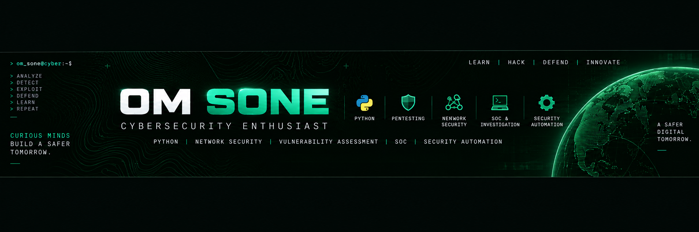

<div align="center">



<br>

# 👋 Hi, I'm Om Sone

### 🔐 Cybersecurity Enthusiast | Python Developer | Security Researcher

</div>

---

## 🧑‍💻 About Me

I'm a student at **MIT ADT University** pursuing **Electronics & Computer Engineering**, with a strong interest in **Cybersecurity, Ethical Hacking, Network Security, and Security Automation**.

🔐 I enjoy exploring vulnerabilities, analyzing networks, and understanding how real-world systems can be secured against cyber threats.

🐍 I build practical cybersecurity tools and projects using **Python, Nmap, Kali Linux, and security automation techniques**.

🛡️ My current work focuses on **vulnerability assessment, penetration testing, SOC investigation, automated security reporting, and cybersecurity automation**.

🚀 I believe the best way to learn cybersecurity is by **building, testing, breaking, and securing real systems**.

🎯 My goal is to continuously improve my technical skills and build security solutions that solve real-world problems.

---

## 🛡️ Cybersecurity Focus

<div align="center">

| 🔎 Vulnerability Assessment | 🌐 Network Security | 🕵️ SOC Investigation |
|:---:|:---:|:---:|
| Nmap • CVE Analysis | Network Reconnaissance | Wireshark • Log Analysis |

| 🧪 Penetration Testing | 🐍 Security Automation | 📊 Security Reporting |
|:---:|:---:|:---:|
| Burp Suite • Metasploit | Python • Automation | Automated Reports |

</div>

---

## 🧰 Tech Stack

### 💻 Programming & Development

<p align="center">


</p>

### 🛡️ Cybersecurity & Tools

<p align="center">


</p>

### 🔧 Security Tools

<div align="center">

`Nmap` • `Burp Suite` • `Metasploit` • `Wireshark` • `Kali Linux`

`Nessus` • `FTK Imager` • `Volatility` • `DVWA`

</div>

---

## 🚀 Featured Projects

### 🛡️ SentinelScan AI

**AI-assisted automated vulnerability assessment and security reporting framework.**

SentinelScan AI automates security reconnaissance, vulnerability detection, CVE analysis, risk assessment, and report generation.

**Tech Stack**

`Python` `Nmap` `CVE Analysis` `Security Automation`

🔗 **[View Project →](https://github.com/soneom14/SentinelScan-AI-v2)**

---

### 🕵️ SOC Investigation Lab

**Hands-on Security Operations Center investigation environment.**

A practical cybersecurity lab focused on reconnaissance, network analysis, service enumeration, traffic analysis, evidence collection, and security investigation.

**Tech Stack**

`Kali Linux` `Nmap` `Metasploit` `Wireshark`

🔗 **[View Project →](https://github.com/soneom14/SOC-Investigation-Lab)**

---

### 🤖 AI-Powered Vulnerability Assessment

**Automated vulnerability assessment and penetration-testing report generation system.**

The project focuses on automating security analysis and converting technical findings into structured security reports.

**Tech Stack**

`Python` `Nmap` `Vulnerability Assessment` `Automated Reporting`

🔗 **[View Project →](https://github.com/soneom14/AI-powered-automated-vulnerability-assessment-pentest-reporting)**

---

### 📡 TrackShield

**IoT-based tracking and monitoring project.**

A tracking system focused on device communication, monitoring, and location-related functionality.

**Tech Stack**

`C++`

🔗 **[View Project →](https://github.com/soneom14/trackshield)**

---

### 🌐 Web Development Projects

Exploring modern web development and building applications using React, JavaScript, HTML, and CSS.

**Tech Stack**

`React` `JavaScript` `HTML` `CSS` `Node.js`

🔗 **[View Repository →](https://github.com/soneom14/webdevcode)**

---

## 📊 GitHub Activity

<div align="center">

### 🔥 Contribution Streak


</div>

---

## 📚 Currently Learning

```text
Cybersecurity
    ├── Network Security
    ├── Penetration Testing
    ├── Vulnerability Assessment
    ├── SOC Operations
    ├── Digital Forensics
    └── Security Automation

Development
    ├── Python
    ├── React
    ├── JavaScript
    └── Backend Development
